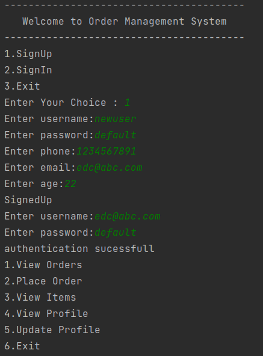

# Welcome to Order Management System

## Features Implemented:
* Admin can login either as a customer or as admin.
* New Users can Signup, create an account and then login to access the application.
* Admin can 
    * View orders placed by all cutomers.
    * View details about all the Items.
    * Create a new item.
    * Delete an existing item.
    * Update an existing item.
    * Update or view his profile.
* Customer can
  * View orders placed by him/her.
  * View Items available for purchase.
  * Place an order.
  * View or Update his profile.
* Option to login as admin is shown only when an admin logins.
* Automatic decrease of stock when an order is placed.
* Orders are not placed when the order quantity of an item is more than the available stock.[feature can be modified for back ordering]
### Homepage:

### SignUp:

### Admin can login as Customer or as Admin:

### Customer Menu:

### View Orders:

### View Order Details:

### Place an order:
* Sucessful Order

* Low stock
  * Here the stock of cola is just 1 but customer tried to order 4 cola.

### View Items:

### View Profile:

### Update Profile:

### Admin Menu:

### Create Item:

### Edit Item:

### Delete Item:
